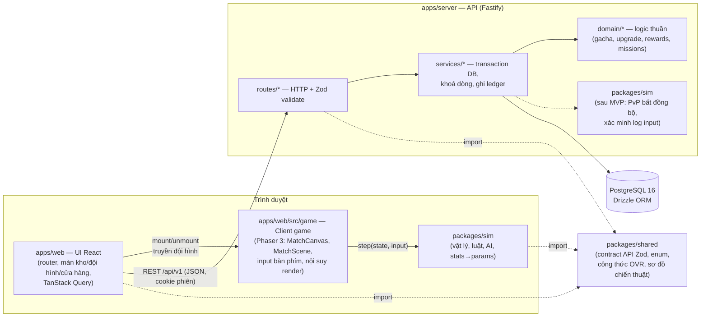
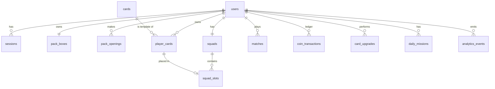
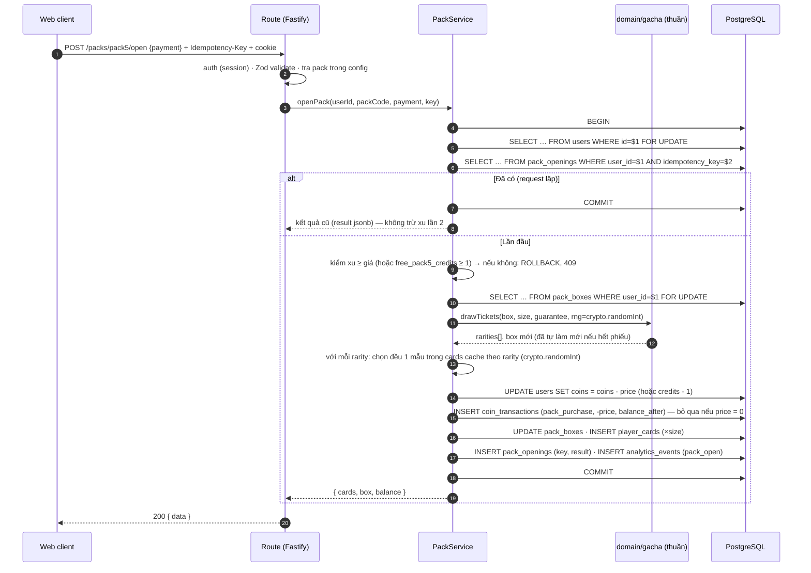

# Kiến trúc — Pitch Cards

_Phiên bản 1.0 — 2026-10-10 — Giai đoạn 3. Nguồn: `docs/PRD.md`, ADR-0001…0007._
_Tài liệu này mô tả **hình dạng** hệ thống. Số liệu kinh tế (giá, tỉ lệ, thưởng) nằm trong PRD và file config server, không lặp lại ở đây._

---

## 1. Tổng quan

Ba nguyên tắc chi phối mọi quyết định bên dưới:

1. **Server quyết định mọi thứ có giá trị**: gacha, ép thẻ, ví xu, thưởng trận. Client chỉ gửi ý định ("mua gói X") và hiển thị kết quả.
2. **Mô phỏng trận là code thuần, tất định** (`packages/sim`, 60 tick/s, PRNG có seed). Phaser chỉ vẽ lại state; server có thể chạy lại cùng code sau MVP.
3. **Một contract cho mỗi ranh giới**: schema Zod trong `packages/shared/src/api` là nguồn sự thật duy nhất cho request/response giữa web và server.

## 2. Sơ đồ module



| Module | Vai trò | Được phép import | Cấm |
|---|---|---|---|
| `apps/web` (UI) | Màn ngoài trận, gọi API, quản lý cache | `shared`, `sim`, React, TanStack Query, dnd-kit | Tự tính kết quả gacha/ví |
| `apps/web/src/game` (client game) | Render trận bằng Phaser, đọc input, nội suy giữa 2 tick | `sim`, Phaser | Logic vật lý/luật (phải nằm trong `sim`) |
| `packages/sim` | `createMatch(setup)`, `step(state, inputs)` thuần; vật lý, luật, AI, thể lực | `shared` | Phaser, React, DOM, `node:*`, `Math.random` (lint chặn) |
| `packages/shared` | Contract API (Zod), enum, công thức OVR/hệ số sai vị trí, sơ đồ | `zod` | Code chạy I/O |
| `apps/server` | REST API, session, transaction, CSPRNG | `shared`, `sim`, Fastify, Drizzle, argon2 | `Math.random` (lint chặn) |
| PostgreSQL | Lưu trữ, ràng buộc toàn vẹn cuối cùng (`CHECK`, `FK`, `UNIQUE`) | — | — |

**Không có "game server" riêng trong MVP** (ADR-0006): trận vs máy chạy ở client; vai trò "game server" do `apps/server` đảm nhận qua match token + kiểm tra kết quả (§5.2). Khi làm PvP thời gian thực sẽ thêm Colyseus và một ADR mới.

### 2.1 Cấu trúc thư mục dự kiến

```
apps/
  web/src/
    app/            router, providers (QueryClient), layout
    api/            fetch wrapper: parse response bằng schema trong @pitch/shared
    features/       auth/ inventory/ packs/ squad/ upgrade/ missions/ match-setup/
    game/           MatchCanvas.tsx, scenes/MatchScene.ts, render/, input/
  server/src/
    app.ts          buildApp() — đăng ký plugin + routes (test bằng inject)
    server.ts       listen
    config/         economy.ts (giá, tỉ lệ, thưởng — PRD §6–7), env.ts
    plugins/        db, session/auth, error-handler, rate-limit
    routes/         auth, cards, player-cards, packs, squad, matches, missions, admin
    services/       transaction + khoá dòng; gọi domain
    domain/         gacha.ts, upgrade.ts, rewards.ts, missions.ts — thuần, nhận rng làm tham số
    db/             schema.ts, migrations/, seed/
packages/
  sim/src/          math/ rng/ physics/ rules/ ai/ stats/ match.ts
  shared/src/       domain.ts (enum, OVR, formation) · api/*.ts (contract từng nhóm endpoint)
```

## 3. Schema database

Quy ước (theo `postgres-patterns`): khoá chính `bigint generated always as identity`; chuỗi dùng `text`; thời gian `timestamptz`; xu là **số nguyên** (`bigint` cho số dư, `integer` cho biến động); tên bảng số nhiều, `snake_case`. Mọi FK đều có index.

Ánh xạ tên trong đề bài → bảng: `user`→`users`, `card`→`cards`, `player_card`→`player_cards`, `pack`→`pack_boxes` + `pack_openings` (danh mục gói nằm trong config, §3.3), `squad`→`squads` + `squad_slots`, `match`→`matches`, `transaction`→`coin_transactions`.



### 3.1 Enum (Postgres `CREATE TYPE … AS ENUM`)

| Enum | Giá trị |
|---|---|
| `position` | `GK`, `DF`, `MF`, `FW` |
| `rarity` | `bronze`, `silver`, `gold`, `legend` |
| `formation` | `2-3-1`, `3-2-1`, `2-2-2` |
| `difficulty` | `easy`, `hard` |
| `match_status` | `started`, `finished`, `expired` |
| `match_outcome` | `win`, `draw`, `loss`, `shootout_win`, `shootout_loss` |
| `card_source` | `starter`, `pack` |
| `coin_tx_type` | `starter_grant`, `pack_purchase`, `card_sale`, `upgrade_fee`, `match_reward`, `mission_reward`, `admin_adjust` |

### 3.2 Bảng

**`users`** — tài khoản và ví
| Cột | Kiểu | Ràng buộc / ghi chú |
|---|---|---|
| id | bigint identity | PK |
| username | text | NOT NULL; `UNIQUE (lower(username))`; 3–20 ký tự `[a-zA-Z0-9_]` (validate ở Zod) |
| password_hash | text | argon2id |
| email | text | NULL (tuỳ chọn) |
| coins | bigint | NOT NULL DEFAULT 0, **`CHECK (coins >= 0)`** |
| free_pack5_credits | smallint | NOT NULL DEFAULT 0, `CHECK (>= 0)` — gói 5 miễn phí của quà tân thủ |
| failed_login_count | smallint | NOT NULL DEFAULT 0 |
| failed_login_window_start | timestamptz | NULL |
| locked_until | timestamptz | NULL — khoá 15 phút sau 5 lần sai (PRD §8) |
| is_admin | boolean | NOT NULL DEFAULT false |
| created_at | timestamptz | NOT NULL DEFAULT now() |

**`sessions`**
| Cột | Kiểu | Ghi chú |
|---|---|---|
| id | text | PK = **SHA-256 của token** (cookie giữ token gốc 32 byte ngẫu nhiên; lộ DB không lộ phiên) |
| user_id | bigint | FK → users ON DELETE CASCADE; index |
| expires_at | timestamptz | NOT NULL; index để dọn phiên hết hạn |
| created_at | timestamptz | NOT NULL |

**`cards`** — ~150 mẫu thẻ hư cấu (seed, chỉ đọc lúc chạy)
| Cột | Kiểu | Ghi chú |
|---|---|---|
| id | integer | PK (cố định theo seed để ổn định giữa các môi trường) |
| code | text | UNIQUE, VD `FW-0042` |
| name, nickname | text | Tên hư cấu + biệt danh lối chơi |
| position | position | |
| rarity | rarity | index `(rarity)` để bốc ngẫu nhiên đều trong độ hiếm |
| pace, shooting, passing, dribbling, defending, stamina | smallint | `CHECK BETWEEN 1 AND 99`; thủ môn vẫn có (dùng cho di chuyển/thể lực) |
| reflexes, handling, positioning, kicking | smallint | `CHECK BETWEEN 1 AND 99`; cầu thủ ngoài sân có giá trị thấp |
| ovr | smallint | Tính bằng công thức trong `@pitch/shared` lúc sinh seed; test đảm bảo khớp và nằm trong khoảng OVR của độ hiếm |
| avatar_seed | text | Tham số sinh ảnh đại diện (không dùng ảnh thật) |

**`player_cards`** — thẻ người chơi sở hữu
| Cột | Kiểu | Ghi chú |
|---|---|---|
| id | bigint identity | PK |
| user_id | bigint | FK → users; index `(user_id, card_id)` |
| card_id | integer | FK → cards |
| level | smallint | NOT NULL DEFAULT 0, `CHECK BETWEEN 0 AND 5` (cấp +) |
| luck | smallint | NOT NULL DEFAULT 0, `CHECK BETWEEN 0 AND 100` (điểm may mắn %, PRD §6.5) |
| source | card_source | |
| acquired_at | timestamptz | NOT NULL |

Bán thẻ / làm nguyên liệu ép → **xoá dòng**. Lịch sử nằm ở `coin_transactions`/`card_upgrades`.

**`pack_boxes`** — hộp 100 phiếu riêng mỗi người (PRD §6.3)
| Cột | Kiểu | Ghi chú |
|---|---|---|
| user_id | bigint | PK, FK → users |
| bronze_left, silver_left, gold_left, legend_left | smallint | `CHECK (>= 0)`; khởi tạo theo config (58/30/10/2) |
| cycle | integer | NOT NULL DEFAULT 1 — tăng mỗi lần hộp tự làm mới |
| updated_at | timestamptz | |

`CHECK (bronze_left + silver_left + gold_left + legend_left BETWEEN 0 AND 100)`. Hộp được tạo cùng lúc với user.

**`pack_openings`** — lịch sử mở gói + khoá idempotency
| Cột | Kiểu | Ghi chú |
|---|---|---|
| id | bigint identity | PK |
| user_id | bigint | FK → users |
| idempotency_key | uuid | **`UNIQUE (user_id, idempotency_key)`** |
| pack_code | text | `pack1` / `pack5` (khớp config) |
| payment | text | `coins` / `free_credit` |
| price | integer | Số xu đã trừ (0 nếu dùng lượt miễn phí) |
| result | jsonb | `[{ playerCardId, cardId, rarity }]` — trả lại nguyên văn khi request lặp |
| box_cycle | integer | Hộp nào được bốc (kiểm toán) |
| created_at | timestamptz | index `(user_id, created_at)` |

**`squads`** + **`squad_slots`** — 1 đội hình / người trong MVP
| Bảng.cột | Kiểu | Ghi chú |
|---|---|---|
| squads.user_id | bigint | PK, FK → users |
| squads.formation | formation | DEFAULT `2-3-1` |
| squads.updated_at | timestamptz | |
| squad_slots.user_id | bigint | FK → squads; PK `(user_id, slot)` |
| squad_slots.slot | text | `GK`, `P1`…`P6` (đá chính, vai trò ô suy từ sơ đồ), `B1`…`B5` (dự bị); `CHECK` theo danh sách |
| squad_slots.player_card_id | bigint | **UNIQUE** (một thẻ chỉ ở một ô); FK → player_cards **ON DELETE RESTRICT** |

`ON DELETE RESTRICT` là chốt chặn cuối ở DB cho luật "thẻ trong đội hình không được bán/ép" (PRD §6.4); service vẫn kiểm trước để trả lỗi `card_in_squad` rõ ràng.

**`matches`** — trận vs máy, match token
| Cột | Kiểu | Ghi chú |
|---|---|---|
| id | bigint identity | PK |
| user_id | bigint | FK; index `(user_id, started_at)` |
| token_hash | text | UNIQUE — SHA-256 của match token (token chỉ trả cho client 1 lần) |
| difficulty | difficulty | |
| status | match_status | `started` → `finished` (một lần) |
| seed | bigint | Seed PRNG của sim (để tái hiện / xác minh sau MVP) |
| squad_snapshot | jsonb | Đội hình + chỉ số lúc bắt đầu (bằng chứng, dùng cho xác minh sau) |
| reward_eligible | boolean | Tính lúc bắt đầu: còn trong 15 trận có thưởng/ngày không |
| started_at, finished_at | timestamptz | |
| home_goals, away_goals | smallint | `CHECK BETWEEN 0 AND 20` (PRD §7) |
| outcome | match_outcome | NULL khi chưa xong |
| reward | integer | NOT NULL DEFAULT 0 |
| reward_day | date | Ngày GMT+7 **của lúc nộp kết quả**; partial index `(user_id, reward_day) WHERE reward > 0` để đếm trần 15 trận |

**`coin_transactions`** — sổ cái, **append-only**
| Cột | Kiểu | Ghi chú |
|---|---|---|
| id | bigint identity | PK |
| user_id | bigint | FK; index `(user_id, id)` |
| type | coin_tx_type | |
| amount | integer | Có dấu: dương = cộng, âm = trừ; `CHECK (amount <> 0)` |
| balance_after | bigint | `CHECK (>= 0)` — số dư ngay sau giao dịch |
| ref_type | text | `match` / `pack_opening` / `card_upgrade` / `player_card` / NULL |
| ref_id | bigint | Không FK (dòng tham chiếu có thể đã bị xoá, VD thẻ đã bán) |
| created_at | timestamptz | |

Trigger `BEFORE UPDATE OR DELETE` → `RAISE EXCEPTION` để bảo đảm append-only. Bất biến đối soát: `users.coins = SUM(amount)` theo user (PRD §7 tiêu chí).
Quà tân thủ hiện không tặng xu nên không sinh dòng ledger (vì `amount <> 0`); thẻ khởi đầu ghi nhận qua `player_cards.source = 'starter'`. Loại `starter_grant` để dành nếu config sau này tặng xu khởi đầu.

**`card_upgrades`** — lịch sử ép thẻ (Should, F10)
| Cột | Kiểu | Ghi chú |
|---|---|---|
| id | bigint identity | PK |
| user_id | bigint | FK; index |
| player_card_id | bigint | Không FK (giữ lịch sử) |
| material_player_card_id | bigint | Thẻ nguyên liệu đã tiêu (không FK) — dùng phát hiện "cùng key khác body" |
| material_card_id | integer | Mẫu thẻ nguyên liệu (kiểm toán) |
| result | jsonb | `{ success, level, luck, rate, fee, balance }` — trả lại nguyên văn khi request lặp |
| from_level, to_level | smallint | |
| rate | smallint | Tỉ lệ đã áp (cơ bản + may mắn) |
| success | boolean | |
| idempotency_key | uuid | `UNIQUE (user_id, idempotency_key)` |
| created_at | timestamptz | |

**`daily_missions`** (Should, F12)
| Cột | Kiểu | Ghi chú |
|---|---|---|
| user_id | bigint | FK |
| day | date | Ngày GMT+7 |
| mission_code | text | Khớp danh sách nhiệm vụ trong config |
| progress, target | smallint | |
| reward | integer | |
| claimed_at | timestamptz | NULL cho tới khi nhận |
| | | PK `(user_id, day, mission_code)` |

**`analytics_events`** (Should, F13)
| Cột | Kiểu | Ghi chú |
|---|---|---|
| id | bigint identity | PK |
| user_id | bigint | NULL được (VD đăng ký thất bại không ghi) |
| name | text | `register`, `login`, `session_seen`, `match_start`, `match_end`, `pack_open`, `upgrade`, `mission_claim` |
| props | jsonb | |
| created_at | timestamptz | **BRIN** index (chuỗi thời gian, chỉ thêm) + index `(name, created_at)` |

### 3.3 Dữ liệu ở config thay vì DB

Danh mục gói (`pack1`, `pack5`), thành phần hộp 100 phiếu, bảng thưởng trận, trần 15 trận/ngày, bảng ép thẻ, giá bán thẻ, danh sách nhiệm vụ → `apps/server/src/config/economy.ts` (PRD §7.4: "mọi con số nằm trong file config phía server"). Client lấy các số cần hiển thị qua API (`GET /packs`, `GET /config/economy`), **không** import trực tiếp.
Công thức OVR, danh sách sơ đồ, hệ số phạt sai vị trí (−15%), **bảng cộng chỉ số theo cấp + (`LEVEL_STAT_BONUS`)** → `packages/shared` vì cả `sim`, web và server đều cần, và đây là luật game chứ không phải số kinh tế.

### 3.4 Khoá và đồng thời

- **Thứ tự khoá cố định** (ADR-0005): `users` → `pack_boxes` → `player_cards` (theo `id` tăng dần) → `squads`. Mọi service tuân theo để tránh deadlock.
- Mọi thao tác **ghi** dữ liệu người chơi (xu, thẻ, đội hình, trận, nhiệm vụ) bắt đầu bằng `SELECT … FROM users WHERE id = $1 FOR UPDATE` — tuần tự hoá mọi giao dịch của cùng một người chơi; người chơi khác không chặn nhau.
- Mức cô lập mặc định `READ COMMITTED` là đủ vì đã khoá dòng tường minh.
- `idle_in_transaction_session_timeout = 30s`, `statement_timeout = 10s` cho role ứng dụng.
- **Thời gian nghiệp vụ** (khoá đăng nhập, 6 phút tối thiểu, ngày GMT+7, reset nhiệm vụ, cohort) luôn lấy từ `app.clock.now()` (tiêm qua `buildApp`, test thay bằng đồng hồ giả) và truyền vào SQL làm tham số. `DEFAULT now()` chỉ dùng cho cột kiểm toán (`created_at`).

## 4. API

### 4.1 Quy ước

- Tiền tố **`/api/v1`**, JSON, URL số nhiều + kebab-case, field JSON **camelCase**.
- **Contract:** mỗi endpoint có schema Zod request/response trong `packages/shared/src/api/<nhóm>.ts`. Server validate request bằng schema đó và có test kiểm response bằng `schema.parse`; web parse response bằng cùng schema. Đổi API = sửa schema trước (quy trình `contract-first`).
- Thành công: `{ "data": … }`. Lỗi: `{ "error": { "code", "message", "details?" } }` (`ApiError` trong `@pitch/shared`).
- ID trong JSON là **chuỗi số** (DB `bigint`).
- Xác thực: cookie `sid` — `HttpOnly; Secure; SameSite=Lax; Path=/`, hạn 30 ngày, gia hạn trượt. Mọi request đổi dữ liệu phải có `Content-Type: application/json` (chặn form CSRF đơn giản) và kiểm `Origin` khớp host. Endpoint không cần dữ liệu (logout, claim) vẫn gửi body `{}` — `apiFetch` của web luôn làm vậy.
- Endpoint gây tốn xu/thẻ nhận header **`Idempotency-Key: <uuid>`** (bắt buộc).
- Rate limit (`@fastify/rate-limit`): 100 req/phút/người dùng; `/auth/*` 10 req/phút/IP.
- Không phân trang trong MVP: kho thẻ một người dự kiến < 500 dòng. Thêm cursor (`?cursor=&limit=`) khi vượt ngưỡng — thay đổi không phá vỡ.

### 4.2 Mã lỗi

| HTTP | `code` | Khi nào |
|---|---|---|
| 400 | `validation_error` | Body/query sai schema (kèm `details[]`) |
| 401 | `unauthenticated` | Thiếu/hết hạn phiên |
| 401 | `invalid_credentials` | Sai tên đăng nhập hoặc mật khẩu (không nói rõ cái nào) |
| 403 | `forbidden` | Không phải admin; tác động lên tài nguyên của người khác |
| 404 | `not_found` | Tài nguyên không tồn tại **hoặc không thuộc người gọi** (không lộ sự tồn tại) |
| 409 | `username_taken` | Đăng ký trùng tên |
| 409 | `insufficient_coins` | Không đủ xu |
| 409 | `card_in_squad` | Bán/ép thẻ đang trong đội hình |
| 409 | `idempotency_conflict` | Cùng key nhưng body khác |
| 422 | `invalid_material`, `max_level`, `invalid_squad` | Vi phạm luật nghiệp vụ |
| 422 | `match_token_invalid` | Token sai/đã dùng/hết hạn/chưa đủ 6 phút/tỉ số vô lý |
| 429 | `login_locked`, `rate_limited` | Khoá đăng nhập; vượt giới hạn (kèm `Retry-After`) |
| 500 | `internal_error` | Lỗi không lường trước (không lộ chi tiết) |

### 4.3 Danh sách endpoint

| # | Method & path | Auth | Request | Response `data` | Ghi chú / PRD |
|---|---|---|---|---|---|
| 1 | `GET /health` | — | — | `{ status }` | Đã có trong skeleton |
| 2 | `POST /auth/register` | — | `{ username, password, email? }` | `Me` | 201. Tạo user + hộp + đội hình mặc định + 11 thẻ khởi đầu + 1 lượt gói 5 miễn phí, **một transaction**. Đặt cookie. F8, F9 |
| 3 | `POST /auth/login` | — | `{ username, password }` | `Me` | Khoá 15' sau 5 lần sai/15'. F8 |
| 4 | `POST /auth/logout` | ✔ | — | — | 204, xoá session |
| 5 | `GET /me` | ✔ | — | `Me` = `{ id, username, coins, freePack5Credits, rewardedMatchesToday, rewardedMatchesLimit }` | |
| 6 | `GET /cards` | — | — | `Card[]` (toàn bộ ~150 mẫu) | Cache dài (`ETag`). Client dùng để hiển thị theo `cardId` |
| 7 | `GET /player-cards` | ✔ | `?position=&rarity=&sort=ovr\|-ovr\|acquired\|-acquired` | `PlayerCard[]` = `{ id, cardId, level, luck, inSquad, effectiveStats }` | F5 kho thẻ |
| 8 | `POST /player-cards/sell` | ✔ | `{ playerCardIds: Id[] (1–50) }` | `{ coinsGained, balance }` | Tất cả hoặc không. Xác nhận Vàng+/thẻ + là việc của UI. F11 |
| 9 | `POST /player-cards/:id/upgrade` | ✔ + Idem | `{ materialId: Id }` | `{ success, level, luck, rate, fee, balance }` | F10 |
| 10 | `GET /config/economy` | — | — | Bảng ép thẻ, giá bán, thưởng trận, trần/ngày | Để UI hiển thị tỉ lệ & giá (đọc từ config server) |
| 11 | `GET /packs` | ✔ | — | `{ packs: [{ code, size, price, guaranteeAvailable }], box: { left: {bronze,silver,gold,legend}, total, nextOdds, cycle } }` | US-04: số phiếu còn & tỉ lệ lần bốc kế |
| 12 | `POST /packs/:code/open` | ✔ + Idem | `{ payment: 'coins' \| 'free_credit' }` | `{ cards: PlayerCard[], box, balance, freePack5Credits }` | 200. Luồng chi tiết ở §5.1. F5 |
| 13 | `GET /squad` | ✔ | — | `{ formation, slots: { [slot]: Id \| null }, teamRating, warnings[] }` | F6 |
| 14 | `PUT /squad` | ✔ | `{ formation, slots }` | như #13 | Thay toàn bộ (idempotent). Kiểm sở hữu, trùng thẻ, ≤ 5 dự bị |
| 15 | `POST /matches` | ✔ | `{ difficulty }` | `{ matchId, token, seed, rewardEligible, home: MatchTeam, away: MatchTeam }` | 201. Kiểm có GK + đủ 7 người (`invalid_squad`). Đội máy sinh ở server. §5.2 |
| 16 | `POST /matches/:id/result` | ✔ | `{ token, homeGoals, awayGoals, shootout?: { home, away } }` | `{ outcome, reward, balance, missions: MissionProgress[] }` | Token dùng 1 lần; nộp lại đúng token cho trận đã `finished` → trả kết quả cũ (không cộng lần 2). `missions` là `[]` cho tới task 7.4. F7 |
| 17 | `GET /missions/today` | ✔ | — | `MissionProgress[]` | Tự tạo 3 nhiệm vụ cho ngày GMT+7 nếu chưa có. F12 |
| 18 | `POST /missions/:code/claim` | ✔ | — | `{ reward, balance }` | Một lần/ngày/nhiệm vụ |
| 19 | `GET /admin/retention` | admin | `?from=&to=` | `[{ cohortDay, registered, d1, d7 }]` | F13 |

`MatchTeam = { formation, players: [{ slot, cardId, level, position, stats (đã áp cấp + và phạt sai vị trí) }] }` — sim nhận thẳng cấu trúc này, client không tự tính chỉ số hiệu lực.

## 5. Luồng phía server

### 5.1 Mở gói thẻ (`POST /packs/:code/open`)



**`drawTickets` (thuần, test được bằng rng giả):**
1. Với mỗi lượt `i` trong `size`: nếu tổng phiếu = 0 → làm mới hộp về 58/30/10/2, `cycle += 1`.
2. Nếu `i` là lượt cuối của gói 5, mọi lượt trước đều `bronze`, và hộp còn phiếu Bạc+ → bốc trong nhóm Bạc+ theo tỉ lệ số còn lại. Ngược lại bốc trên toàn hộp theo tỉ lệ số còn lại.
3. Bốc = `r = randomInt(0, total)`, đi qua `[legend, gold, silver, bronze]` cộng dồn cho tới khi `r < cumulative`; trừ 1 phiếu ở độ hiếm đó.

**Bất biến được test** (PRD §6.3): mở hết 100 phiếu → đúng 2/10/30/58; 10.000 hộp → chi-bình phương p > 0,01 theo từng vị trí bốc; gói 5 không bao giờ ra 5 Đồng khi hộp còn Bạc+; 2 request song song với cùng/khác key → không âm xu, không mở trùng; random chỉ đến từ `node:crypto`.

**Lỗi và hoàn tác:** mọi lỗi giữa `BEGIN` và `COMMIT` → `ROLLBACK`, không trạng thái nào thay đổi. Vi phạm `UNIQUE (user_id, idempotency_key)` do race (không thể xảy ra khi đã khoá `users`, nhưng là chốt chặn) → đọc lại kết quả cũ.

### 5.2 Trận đấu vs máy (match token)

1. `POST /matches`: khoá `users`, đếm trận có thưởng hôm nay (GMT+7) → `reward_eligible`; sinh token 32 byte, lưu `token_hash`, `seed`, `squad_snapshot`; sinh đội máy theo độ khó (OVR ~60 / ~78, từ `cards`).
2. Client chạy `sim` với `home`, `away`, `seed`; Phaser render.
3. `POST /matches/:id/result`: khoá `users` rồi `matches … FOR UPDATE`; nếu `status = finished` và token khớp → trả lại kết quả đã lưu (client retry khi mất response); kiểm `status = started`, `hash(token) = token_hash`, `now - started_at ≥ 6 phút` (cấu hình được cho test), tỉ số ≤ 20, `shootout` chỉ có khi hoà; tính `outcome` + `reward` (`domain/rewards.ts`), đếm lại trần 15 trận theo `reward_day` = ngày GMT+7 của **lúc nộp** trong cùng transaction; cập nhật xu + ledger + nhiệm vụ + analytics; `status = finished`.
4. Trận bỏ dở không nộp → `expired` sau 2 giờ (dọn lười khi người chơi bắt đầu trận mới).

### 5.3 Ép thẻ, bán thẻ

Cùng khuôn với §5.1: `BEGIN` → khoá `users` → khoá `player_cards` của thẻ đích + nguyên liệu (theo `id` tăng dần) → kiểm sở hữu/không trong đội hình/cùng độ hiếm trở lên/chưa +5 → `domain/upgrade.ts` quay tỉ lệ bằng `crypto.randomInt(0, 100) < rate` → xoá nguyên liệu, cập nhật `level`/`luck`, trừ phí, ghi `coin_transactions` + `card_upgrades` → `COMMIT`.

## 6. Mô phỏng trận (`packages/sim`)

- API: `createMatch(setup: { home, away, seed, difficulty, halfLengthSec }) → MatchState`; `step(state, inputs: PlayerInput) → MatchState` (thuần, không đọc đồng hồ); `getEvents(state)` cho HUD/âm thanh.
- Bước cố định `TICK_DT = 1/60`. Client gom thời gian thực vào accumulator, chạy đủ số tick, Phaser nội suy vị trí giữa tick trước và tick hiện tại.
- PRNG: mulberry32 (hoặc tương đương) có seed, nằm trong state → cùng seed + cùng chuỗi input = cùng kết quả (PRD §5 tiêu chí).
- Tầng: `physics/` (bóng có độ cao z, ma sát, va chạm cột) · `rules/` (biên, góc, phát bóng, phạm lỗi, thẻ, luân lưu, đồng hồ) · `ai/` (tầng đội: đội hình/trạng thái tấn–thủ; tầng cầu thủ: steering + quyết định chuyền/sút/rê) · `stats/` (chỉ số thẻ → tham số gameplay, thể lực).
- Test mô phỏng headless bằng Vitest: AI-vs-AI 100 trận, 1.000 cú sút — chạy trong Node, không cần trình duyệt.

## 7. Bảo mật (tóm tắt)

| Mối đe doạ | Biện pháp |
|---|---|
| Sửa request để tự cộng xu/thẻ | Client không gửi số xu/thẻ; server tính từ config + DB. Response không chứa gì client có thể "gửi lại" để có lợi |
| Mở gói 2 lần (double click, retry) | `Idempotency-Key` + `UNIQUE` + khoá `users` |
| Race làm âm xu | `FOR UPDATE` + `CHECK (coins >= 0)` |
| Gian lận kết quả trận | Match token 1 lần, ≥ 6 phút, tỉ số ≤ 20, trần 15 trận/ngày; sau MVP: xác minh bằng log input (BACKLOG) |
| Đoán tỉ lệ / RNG | `node:crypto`; lint cấm `Math.random` ở server |
| Chiếm phiên | Cookie HttpOnly/Secure/SameSite=Lax, lưu hash token, xoay token khi đăng nhập |
| Dò mật khẩu | argon2id, khoá 15' sau 5 lần sai, rate limit `/auth/*` |
| IDOR | Mọi truy vấn lọc theo `user_id` của phiên; trả 404 thay vì 403 cho tài nguyên người khác |

## 8. Môi trường & vận hành

| Môi trường | Thành phần |
|---|---|
| Dev | `pnpm dev`: Vite :5173 (proxy `/api` → :3000) + Fastify :3000 (`tsx watch`). Postgres 16 chạy bằng Docker (`docker compose -f docker-compose.dev.yml up -d`, thêm ở task 6.1) |
| Test | Vitest. Test DB-integration dùng Postgres thật qua `DATABASE_URL_TEST`; mỗi test chạy trong transaction rồi rollback, hoặc truncate giữa các file |
| Prod | Docker Compose: Caddy (HTTPS + file tĩnh web + reverse proxy `/api`) + server + Postgres (ADR-0007). Migration chạy khi server khởi động |

Biến môi trường (server): `DATABASE_URL`, `SESSION_SECRET`, `PORT`, `HOST`, `NODE_ENV`, `MATCH_MIN_DURATION_SEC` (mặc định 360; test đặt nhỏ), `ENABLE_DEV_ROUTES` (chỉ bật route `/api/v1/dev/*` khi `=1`; mặc định tắt — không suy ra từ `NODE_ENV`).
Quyền admin: cột `users.is_admin`, bật bằng script `pnpm --filter @pitch/server admin:grant <username>` (không có API cấp quyền).

## 9. Quyết định mở (chưa cần ADR)

- Animation lật thẻ: CSS/Framer Motion hay scene Phaser nhỏ → Giai đoạn 4.
- Cách sinh ảnh đại diện thẻ (`avatar_seed`) → Giai đoạn 4.
- Có cần cursor pagination cho kho thẻ → khi kho > 500 thẻ.
